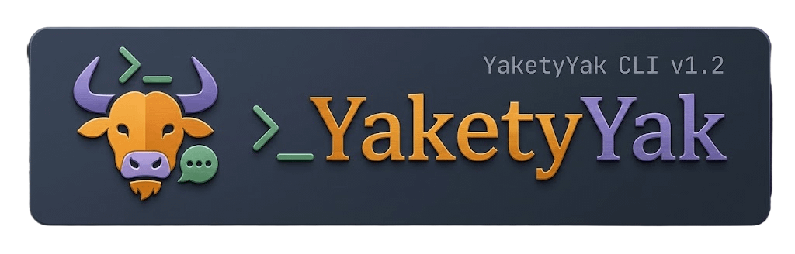

<p align="center">
  
</p>

<h1 align="center">Yakety Yak</h1>

<p align="center">
  <strong>A split-pane terminal that explains everything happening on screen — commands, output, and errors — in plain language, as you type.</strong>
</p>

<p align="center">
  <a href="https://github.com/myiephero/Yaketyyak/releases/latest"></a>
  <a href="https://github.com/myiephero/Yaketyyak/stargazers"></a>
  <a href="https://github.com/myiephero/Yaketyyak/releases"></a>
  <a href="#license"></a>
  
  
</p>

<p align="center">
  <a href="#download">Download</a> &bull;
  <a href="#how-it-works">How It Works</a> &bull;
  <a href="#features">Features</a> &bull;
  <a href="#git-translator">Git Translator</a> &bull;
  <a href="#themes">Themes</a> &bull;
  <a href="#building-from-source">Build</a>
</p>

---

## What Is Yakety Yak?

Yakety Yak is a **cross-platform terminal emulator with a built-in translator panel**. It runs a real shell (`bash` or `zsh`) on the left and shows plain-language explanations of every command, output, and error on the right — in real time.

It's built for people who are learning the command line, vibe coders who want to understand what their terminal is doing, and anyone who's ever been intimidated by a wall of text in a terminal window.

**No account. No internet. No API key. Just download, open, and start learning.**

### The Problem

You type a command. The terminal spits out 40 lines of text. You have no idea what just happened. So you copy-paste it into Google, open 3 Stack Overflow tabs, read a blog post from 2014, and *maybe* figure it out.

### The Solution

Yakety Yak sits next to your real shell and translates everything as it happens. It's like having a patient, knowledgeable friend sitting next to you explaining what's going on.

---

## Download

| Edition | What You Get | Size |
|---------|-------------|------|
| **Lite** | 507 commands + 52 error patterns explained instantly. Works 100% offline. No AI required. | ~24 MB |
| **Full + AI** | Everything in Lite, plus a local AI (Ollama + Qwen2.5-Coder) that understands *any* command. | ~24 MB + ~1 GB model |

Both editions are **free, open source, and work offline**.

> **[Download the latest release](https://github.com/myiephero/Yaketyyak/releases/latest)**

### First Launch on macOS

macOS blocks apps from unidentified developers. Right-click the app and choose **Open**, then click **Open** in the dialog. You only need to do this once.

---

## How It Works

```
┌─────────────────────────┬──────────────────────────┐
│                         │                          │
│     REAL SHELL          │     TRANSLATION          │
│                         │                          │
│  $ ls -la               │  📖 ls -la               │
│  total 48               │                          │
│  drwxr-xr-x  5 user     │  This lists all files    │
│  -rw-r--r--  1 user     │  in the current folder,  │
│  ...                    │  including hidden ones.  │
│                         │  The -l flag shows the   │
│                         │  long format with        │
│                         │  permissions, owner,     │
│                         │  and file sizes.         │
│                         │                          │
│  $ _                    │  The -a flag includes    │
│                         │  hidden files (ones      │
│                         │  starting with a dot).   │
│                         │                          │
└─────────────────────────┴──────────────────────────┘
```

### Translation Pipeline

Yakety Yak uses a **three-tier translation engine** that prioritizes speed and privacy:

1. **Local Knowledge Base** (instant, always works) — 507 commands and 52 error patterns with hand-written explanations. Responds in under 1ms.
2. **Ollama** (local AI, free, private) — If installed, uses `qwen2.5-coder:1.5b` to generate explanations for commands the knowledge base doesn't cover. Runs entirely on your machine.
3. **OpenAI Cloud** (optional) — Falls back to GPT-5 if you set an `OPENAI_API_KEY`. For users who want the most advanced explanations.

The app always tries the fastest, most private option first. If the local KB handles it, no AI is involved at all.

---

## Features

### 4 Skill Modes

Explanations adapt to your experience level. Cycle through modes with `Ctrl+B`:

| Mode | Who It's For | Style |
|------|-------------|-------|
| **Noob** | Never touched a terminal | Full hand-holding, real-world analogies, celebrates wins |
| **Beginner** | Just starting out | Simple, clear, supportive |
| **Intermediate** | Comfortable with basics | Focused, practical, uses proper terminology |
| **Advanced** | Experienced developer | Terse, edge cases, pro tips only |

### 25 Guided Starter Commands

Type `try` to see a list of safe, educational commands. Type `try 1` through `try 25` to run them automatically and see explanations.

### Smart Detection

- Paste any `https://github.com/owner/repo` URL and it auto-detects and launches the Git Translator
- Type `/git owner/repo` as a shorthand
- Commands, errors, and output are all translated separately with appropriate context

### Keyboard Shortcuts

| Key | Action |
|-----|--------|
| `Ctrl+B` | Cycle skill mode (Noob → Beginner → Intermediate → Advanced) |
| `Ctrl+G` | Toggle Git Translator view |
| `Ctrl+T` | Toggle AI on/off |
| `Ctrl+S` | Switch theme (Terminal / Glass) |
| `Ctrl+L` | Clear translation panel |
| `Ctrl+Q` | Quit |

---

## Git Translator

Press `Ctrl+G` or type `/git <url>` to analyze any public GitHub repository. The Git Translator fetches live data from the GitHub API and generates a comprehensive report:

### What It Shows

- **Quality Score** (0-100) — Calculated from stars, forks, contributors, maintenance activity, licensing, and more
- **Verdict** — Excellent / Good / Fair / Caution with a summary
- **KPI Dashboard** — Stars, forks, watchers, open issues, contributors, releases
- **Languages Breakdown** — Color-coded bar chart of languages used
- **Risk Flags** — No license, stale repo, archived, single contributor, too many open issues
- **Reward Flags** — Actively maintained, many contributors, proper licensing, releases published
- **Project Timeline** — Created/updated dates, age, days since last update
- **Topics & Links** — Repository topics, homepage, wiki, and GitHub Pages status

### Scoring Breakdown

| Factor | Points |
|--------|--------|
| Stars (1-100+) | up to 15 |
| Forks | up to 10 |
| Contributors | up to 10 |
| Recent updates | up to 15 |
| License present | 10 |
| Releases published | up to 10 |
| Description present | 5 |
| Low issue ratio | up to 5 |
| Not archived | 5 |
| Not a fork | 5 |
| Has homepage | 5 |
| Has wiki/pages | up to 5 |

---

## Themes

Two polished visual themes, toggled with `Ctrl+S`. Your preference is saved to `~/.yakety-yak/preferences.json`.

### Terminal Theme
Classic hacker aesthetic. Dark background (`#0a0e17`), green accents (`#10b981`), sharp borders.

### Glass Theme
Modern glassmorphic aesthetic. Deep indigo background (`#0f0a2e`), purple/blue accents (`#6366f1`, `#a78bfa`), rounded borders, translucent panels.

---

## Architecture

```
app.py                 ← Main Textual TUI application
├── translator.py      ← Three-tier translation engine (KB → Ollama → OpenAI)
├── knowledge_base.py  ← 507 commands, 52 error patterns, 6 output patterns
├── themes.py          ← Terminal + Glass theme CSS, preference persistence
├── build.py           ← PyInstaller build script (Lite + Full editions)
├── server.py          ← Flask landing page server
├── tui_preview.py     ← Interactive web-based TUI preview
├── templates/
│   └── index.html     ← Landing page (animated demo, download cards)
└── static/
    ├── style.css      ← Landing page styles
    ├── logo-icon.png  ← App logo
    ├── yak-banner.png ← GitHub banner
    └── ...            ← Favicons, wordmark, mascot
```

### Real Shell Integration

Yakety Yak doesn't simulate a terminal — it runs a **real shell** via `pty.openpty()` and `os.fork()`. Commands execute in a real environment with your real `$PATH`, environment variables, and shell configuration. The app captures stdout/stderr from the PTY master file descriptor and pipes it to both the shell panel and the translation engine.

### Translation Engine

```python
def translate(command, output, mode, use_ai):
    # 1. Try local knowledge base (instant)
    result = knowledge_base.lookup(command)
    if result:
        return result

    # 2. Try Ollama local AI (private, free)
    if ollama_available:
        return ollama_translate(command, output, mode)

    # 3. Fall back to OpenAI cloud
    if openai_key:
        return openai_translate(command, output, mode)

    return "No translation available"
```

### Knowledge Base

The built-in knowledge base covers:
- **507 commands** — from `ls` and `cd` to `awk`, `sed`, `docker`, `git rebase`, and more
- **52 error patterns** — "command not found", "permission denied", segfaults, Python tracebacks, Node.js errors
- **6 output patterns** — recognizes common output formats (file listings, git status, etc.)

The knowledge base is stored at `~/.yakety-yak/terminal_knowledge_base.json` and is user-editable.

---

## Building from Source

### Prerequisites

- Python 3.10+
- pip

### Install Dependencies

```bash
pip install textual pexpect openai flask pyinstaller certifi
```

### Run in Development

```bash
python app.py
```

### Build Standalone Executables

```bash
python build.py          # Both Lite and Full editions
python build.py --lite   # Lite only (~24 MB)
python build.py --full   # Full + AI edition
```

#### What the Build Produces

**macOS:**
- `Yakety Yak.app` — Native macOS application bundle
- `.icns` icon file auto-generated
- Drag-to-Applications workflow

**Linux:**
- Standalone ELF binary
- `.desktop` launcher file
- XDG-compliant installation

**Both editions:**
- Single-file executable (no Python runtime needed)
- Bundled knowledge base, themes, and SSL certificates
- Full edition includes Ollama setup scripts

---

## CI/CD

Automated builds via GitHub Actions (`.github/workflows/build-release.yml`):

- Triggered on version tags (`v*`)
- Builds macOS (Intel + Apple Silicon) and Linux x86_64
- Creates GitHub Release with:
  - `YaketyYak-Lite-macOS.zip`
  - `YaketyYak-Full-macOS.zip`
  - `YaketyYak-Lite-Linux.tar.gz`
  - `YaketyYak-Full-Linux.tar.gz`
- Auto-generated release notes

---

## Privacy

- **Lite Edition**: Zero network calls. Everything runs locally.
- **Full Edition with Ollama**: AI runs on your machine. No data leaves your computer.
- **Cloud AI (optional)**: Only used if you explicitly set `OPENAI_API_KEY`. Commands are sent to OpenAI's API.
- **No telemetry**. No analytics. No accounts. No tracking.

---

## System Requirements

| Platform | Requirement |
|----------|------------|
| macOS | Catalina (10.15) or later |
| Linux | Ubuntu 20.04+, Fedora 34+, or equivalent |
| Windows | Windows 10/11 with WSL |
| Storage | 24 MB (Lite) / ~1.2 GB with AI model |

---

## License

MIT License. See [LICENSE](LICENSE) for details.

---

<p align="center">
  <strong>Made for new coders, vibe coders, and anyone intimidated by the command line.</strong>
</p>

<p align="center">
  <a href="https://github.com/myiephero/Yaketyyak/releases/latest">Download Yakety Yak</a>
</p>
